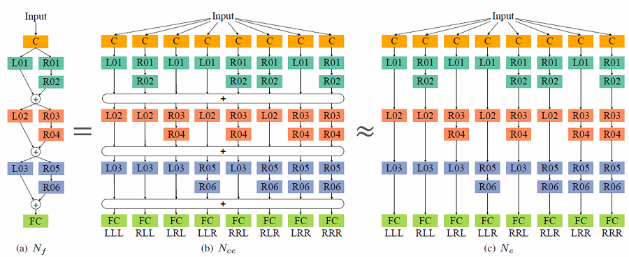
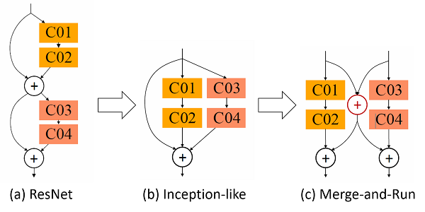
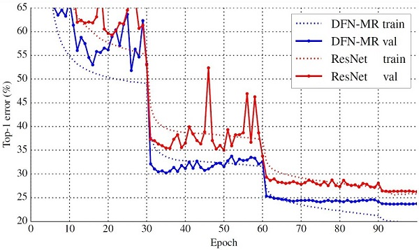

# Deep Fusion Project

This project contains the models used for the experiments in the paper:

>[Liming Zhao](http://www.zhaoliming.net/), 
[Jingdong Wang](http://research.microsoft.com/en-us/um/people/jingdw/), 
[Xi Li](http://mypage.zju.edu.cn/xilics), 
[Zhuowen Tu](http://pages.ucsd.edu/~ztu/), 
and [Wenjun Zeng](https://www.microsoft.com/en-us/research/people/wezeng/). 
"On the Connection of Deep Fusion to Ensembling." 
arXiv preprint [arXiv:1611.07718](http://arxiv.org/abs/1611.07718) (2016).

Contact: Liming Zhao (zhaoliming@zju.edu.cn)

## Introduction
In this work, we provide a systematic study to the prevailing ResNet architecture by showing a connection from a general deeply-fused net view to ensembling.



>Our empirical results uncover that the deepest network among the ensemble components does not contribute the most significantly to the overall performance and instead it provides a manner to introduce many layers and thus guarantee the ensemble size.

Guided by the above study and observation, we develop a new deeply-fused network that combines two networks in a merge-and-run fusion manner.



Our approach demonstrates consistent improvements over the ResNet with the comparable setup
on CIFAR-10, CIFAR-100, SVHN, and ImageNet.

## Results
- Test error (%) on CIFAR (flip/translation augmentation) and SVHN (no augmentation):

Method  | Depth | #Params | CIFAR-10 | CIFAR-100|  SVHN    
--------|:-----:|:-------:|:--------:|:--------:|:--------:
DFN-MR1 |   56  |  1.7M   |   4.94   |   24.46  |   1.66   
DFN-MR2 |   32  |  14.9M  |   3.94   |   19.25  | **1.51** 
DFN-MR3 |   50  |  24.8M  | **3.57** | **19.00**|   1.55   

- Empirical results on ImageNet:



## Requirements
- Install [MXNet](http://mxnet.readthedocs.io/en/latest/how_to/build.html) on a machine (Windows, Linux, and Mac OS) with CUDA GPU and optional [cuDNN](https://developer.nvidia.com/cudnn).

- Apply my modified data processing patch on the latest MXNet by merging the pull request:
    
    ```shell
git pull origin pull/3936/head master
    ```
    
- If you fail to apply the above patch, you can simply use [my MXNet repository](https://github.com/zlmzju/mxnet/tree/fusenet):
    
    ```shell
git clone --recursive -b fusenet https://github.com/zlmzju/mxnet.git
    ```

## How to Train

Step by step tutorial with jupyter notebook is now available, please check the file [tutorial.ipynb](tutorial.ipynb).

### dataset
You can prepare the `*.rec` file by yourself, or simply download the `Cifar` dataset from [data.dmlc.ml](http://data.dmlc.ml/mxnet/data/) or my [google drive](https://drive.google.com/open?id=0By55MQnF3PHCQmRhRTBuWk5DRkk), which includes both `Cifar` and `SVHN` datasets.

### training
Current code supports training different deeply-fused nets on Cifar-10, Cifar-100 and SVHN, such as `plain` network, `resnet`, `cross` (dfn-mr),`half` (dfn-il), `side` (dfn-il without identities), `fuse3` (three fusions), `fuse6` (six fusions), and `ensemble` (with sharing weights, training code will come later). All the networks are contained in the `network` folder.

Note that the codes for training on `ImageNet`  are available in the `network/imagenet` folder, but they still need refactoring to merge into the main codes.

For example, running the following command can train the `DFN-MR` network (we call it `cross` in the coding stage) on Cifar-10.

```shell
python train_model.py --dataset=cifar10 --network=cross --depth=56 --gpus=0,1 --dataset=<dataset location>
```

## Other usages

### visualization
If you want to show the network architecture, run the following command to visualize the network.

```shell
python show_model.py --network=half --depth=26 --widen-factor=1
```

You will obtain a picture [half_d26.png](./visualize/half_d26.png) in the [visualize](./visualize/) folder, and more examples can be found there.

Note that you may need to install [graphviz](http://graphviz.readthedocs.io/en/latest/manual.html#installation) for visualization.

### show results
The training log are saved to `snapshot` folder, and you can use `get_results.py` to obtain the final result of multiple runs in the format of `median (mean +/- std, best)`.

## Citation
Please cite our papers on deep fusion in your publications if it helps your research:

```
@article{WangWZZ16,
  author    = {Jingdong Wang and
               Zhen Wei and
               Ting Zhang and
               Wenjun Zeng},
  title     = {Deeply-Fused Nets},
  journal   = {CoRR},
  volume    = {abs/1605.07716},
  year      = {2016},
  url       = {http://arxiv.org/abs/1605.07716},
}
```

```
@article{ZhaoWLTZ16,
  author    = {Liming Zhao and
               Jingdong Wang and
               Xi Li and
               Zhuowen Tu and
               Wenjun Zeng},
  title     = {On the Connection of Deep Fusion to Ensembling},
  journal   = {CoRR},
  volume    = {abs/1611.07718},
  year      = {2016},
  url       = {http://arxiv.org/abs/1611.07718},
}
```
